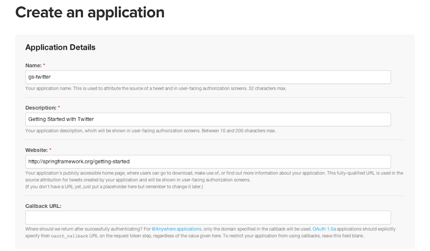
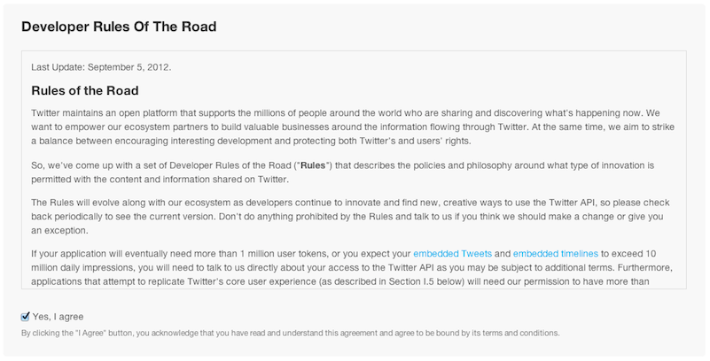

Getting Started: Registering an Application with Twitter
=======================================================
This guide walks you through the steps of registering an application that you can integrate with Twitter.  Registering the application is the first step in developing an application that is integrated into its users' social graph.

You perform the steps in this guide in your web browser on Twitter.com. Although you won't be writing any code, you'll use a simple utility project to verify that you performed the steps correctly. Instructions for getting and running the utility are at the end of this guide.

Register a new application
-----------------------------
All Twitter users are potentially Twitter application developers. Simply visit http://dev.twitter.com and sign in with your Twitter credentials.

From http://dev.twitter.com, find your avatar in the upper-right corner and move your mouse over it. You see a menu that includes (among other things) "My applications". Select "My applications" to see a page that will list all your Twitter applications, once you create them. You haven't created any applications yet, so the list is empty. 

Click the  button near the top. A new page with the _Create an application_ form requires basic information about your application.

In the _Name_ field, name your application in 32 characters or fewer. This name is presented to users when they are prompted to authorize your application to access their Twitter information. In the Description_ field, describe your application in 10 to 200 characters. Again, this is presented to users on authorization screens.

In the _Website_ field, give a URL that points the user back to your application, where they can download it or find out more information. As with _Name_ and _Description_, this field is presented on user-facing authorization screens.

The _Callback URL_ field can specify the URL were Twitter should redirect after a successful authorization. It is best to leave this field blank and to explicitly specify the callback URL at authorization time.

The developer _Rules Of The Road_ section outlines rules you must agree to follow if you build an application that uses Twitter's API. 

The rules include style guidelines on how to present tweets and cautions against simply recreating the functionality of Twitter's own clients. It is recommended that you read these rules closely to make sure you don't violate them.

If you agree to the rules, check "Yes, I agree".

A Captcha challenge ensures that you're not setting up applications through an automated process.

Click "Create your Twitter application" to complete the form and go to the application settings page.
 

Here you configure details about your application, according to what kind of application you plan to build and what you want it to do. 

The main fields to note are __Consumer key__ and __Consumer secret__. These values are your application's credentials for Twitter.You need them to do almost anything with Twitter, including going through the OAuth authorization flow and working with Twitter's REST API.

Verify the registration
--------------------------
Now you can use your consumer key and secret to access Twitter's API. The [sample utility application in GitHub][sampleapp] is an example of an application that can use the consumer key and secret to search Twitter.

You can clone the utility project from GitHub:

    git clone https://github.com/springframework-meta/gs-register-twitter-app.git

To run the utility, simply run it from the command line like this:

    mvn package && java -jar target/gs-register-twitter-app-0.1.0.jar

You'll be prompted by two dialogs. The first will ask for the application's Consumer ID and the second will ask for the application's Consumer Secret. Copy and paste the values from the Twitter Developer's site.

The application then queries Twitter's REST API, searching for Tweets that have "#springframework" in the text. If you've set your application up correctly, you should see the text of several matching Tweets.

Summary
----------
Congratulations! You have now registered an application with Twitter.

[sampleapp]: https://github.com/springframework-meta/gs-register-twitter-app

